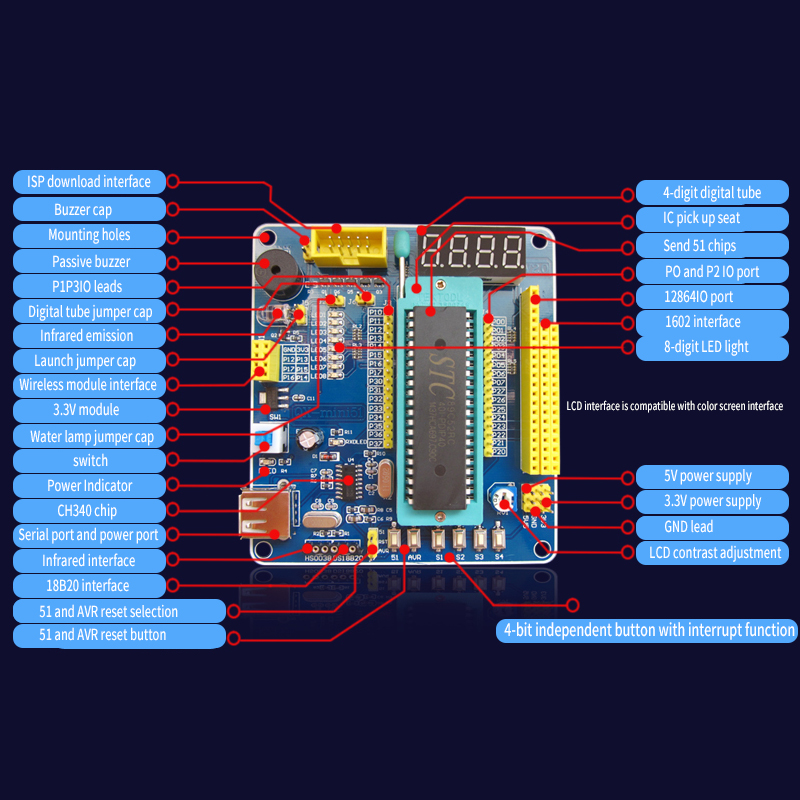
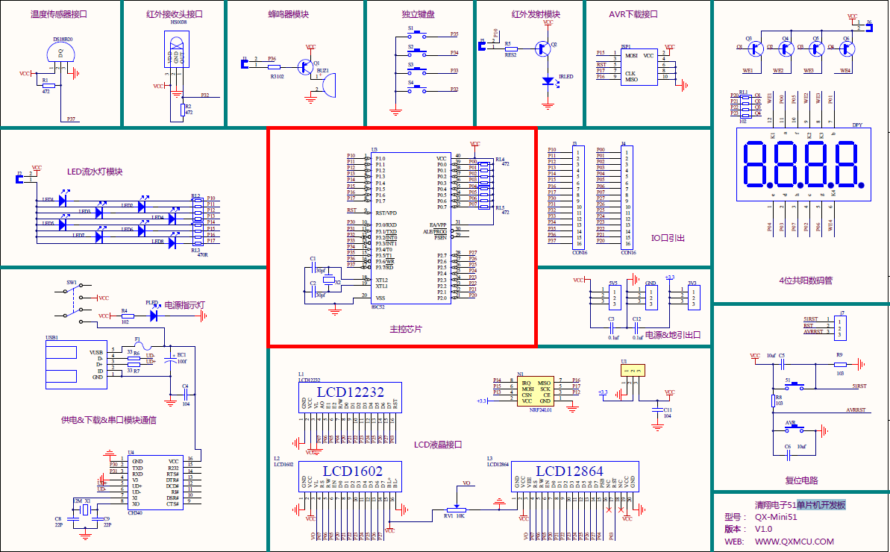

# QX-mini51-SDCC

Sample programs for the QX-mini51 for SDCC toolchain adapted from the ones in the [QX-mini51 sample programs repo](https://github.com/kenyapcomau/QX-mini51) which used the Keil compiler:

I have tried to replicate the functionality and stay close to the the Keil versions even if some code could be improved. Besides the syntax changes needed, e.g. interrupt 4 to __interrupt(4), obviously unidiomatic code has been improved, such as:

	for (j; j < 10; j++)	// remove the first expression, it does nothing
	dat = dat << 1;		// use dat <<= 1
	BEEP = !BEEP;		// use BEEP ^= 1 for flipping a bit

In most programs I have sorted routines topologically to avoid forward prototype declarations. I also ran the programs through indent to make the indentation uniform.

I have gathered common port macros, and typedefs for uchar and uint into include files to reduce duplication. Some macro references were edited to this common standard. The port macros also serve to document the I/O space.

There is a common included makefile fragment in common/common.mk to reduce duplication of rules. Note the pseudo target %.flash that calls stcgal to download the program to the development board if you invoke for example:

	make marquee.flash

Note that late model 89C52s most likely need to use the 7.2 protocol so the stc12 architecture is specified to stcgal as a workaround until this is fixed in the stcgal sources.

I have also provided code::blocks project files so that you can use that IDE.

There are 4 jumpers on board which are opened to disable the buzzer, 8-LED bank, IR transmitter LED, and 7-segment LEDs, respectively. Some experiments will require disconnection of the jumper when the port pins are otherwise used.

Some of the program require extra peripherals not included in the basic kit, so I have no way to verify that they work without getting the extra hardware. If you fix such a program feel free to submit a pull request.

The delay times in some programs may need some tweaking due to differences between Keil and SDCC code generation.

Bear in mind that these are example programs and only intended to get you started. For example the timer/clock program has no way of setting the time, it just starts at 0.

A brief description of the origin of this project can be found on [Hackaday.io](https://hackaday.io/project/170540-adventures-with-a-stc89c52-development-board).

